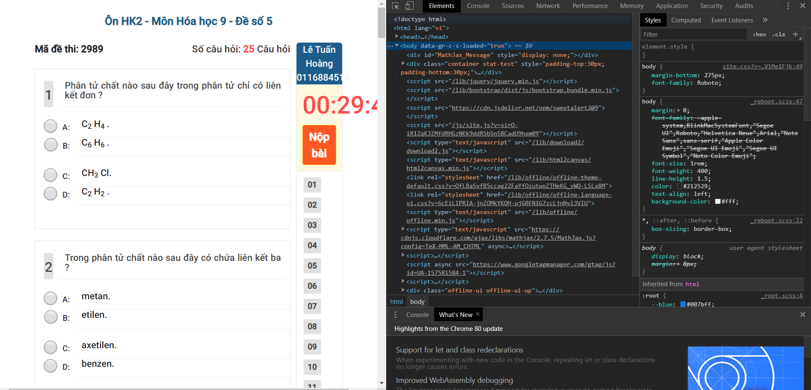
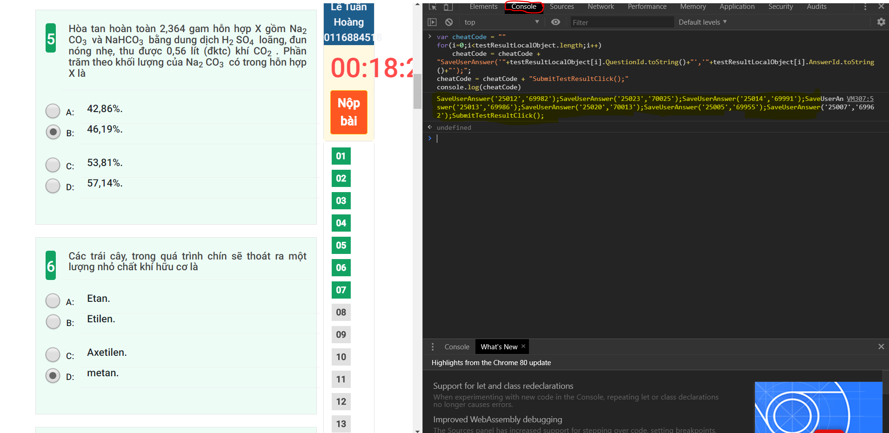

# Giảm thời gian làm bài cho study.hanoi.edu.vn
## I/ Giới thiệu
- Không có gì ngoài việc thêm vào cho đầy đủ
## II/ Cách sử dụng
### 1. Cách lấy hàm để cheat của một bài bất kì
  - B1: Đăng nhập, chọn một đề và làm đúng 100% nhưng chưa nộp bài vội
  - B2: Bấm F12 hoặc Ctrl + Shift + I để bật Chrome DevTools
  
  
  
<b>Sau khi bật Chrome DevTools<b>

  
  - B3: Vào mục Console, copy phần code trong file 'cheatCode.js', paste vào và Enter
  - B4: Copy phần output, đó là hàm để chạy lần sau
  
  
  
<b>Mục Console khoanh màu đỏ, phần hàm cần copy tô màu vàng nhạt<b>

  
  - B5: Copy xong thì nộp bài đi hoặc không thích thì tắt đi cũng được
  
### 2. Cách cheat
  - B1: Đăng nhập, vào một đề (đúng với đề của hàm đã tìm được)
  - B2: Bấm F12 hoặc Ctrl + Shift + I để bật Chrome DevTools
  - B3: Paste phần hàm vào, bấm Enter
  
  ***Lưu ý: Làm càng nhanh càng tốt!!!***
