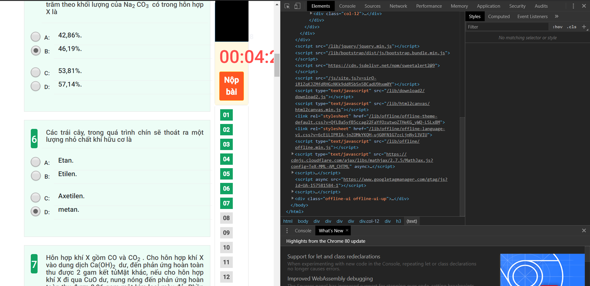
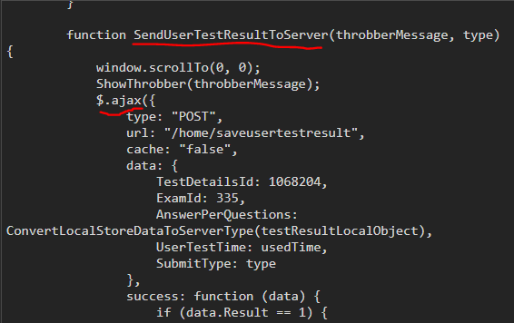
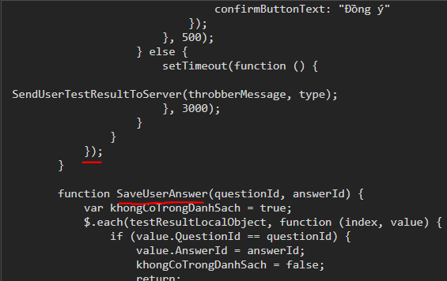

# Lấy đáp án cho study.hanoi.edu.vn
## Nếu thấy code hay và có ích thì hãy cho mình một Star và đừng quên chia sẻ cho bạn bè nhé!
## :warning: This project is no longer supported :warning:
## N/ Thông báo :exclamation:
- **6:06 CH 15/04/2020 GMT+7**:
   + Hệ thống đã sửa lại cách auto rồi. Theo mình thì đây là một lỗ hổng khá là nghiêm trọng nên mình biết kiểu gì cũng đến ngày này. Từ bây giờ cách auto không dùng được nữa. Cách duy nhất là làm thủ công 2 lần thôi.
   + Cảm ơn các bạn đã đồng hành cùng mình.
   + **FROM _♕RED♚QUEEN♕_  !** 

- **11:30 SA 13/04/2020 GMT+7**:
   + Sau khi nhập được đề xuất của các bạn thì mình đã tạo một kênh Youtube: https://www.youtube.com/channel/UC2h_FyXgyfGyUa9TVriLrUg. Các bạn vào đây để xem hướng dẫn chi tiết nhé!
   + **Các bạn có thể gỡ extension Moesif Orign & CORS Changer đi nhé vì nó không có tác dụng! Vô cùng xin lỗi các bạn!**
   + **FROM _♕RED♚QUEEN♕_  !** 
   
- **7:33 CH 12/04/2020 GMT+7**:
   + Mình bổ sung thêm phần tổng quan về phiên bản Auto mới (II/-3). Các bạn có thể xem hướng dẫn của các chức năng mới của code Auto (II/-2) ở đó!
   + **FROM _♕RED♚QUEEN♕_  !** 

- **11:11 SA 12/04/2020 GMT+7**:
   + Mình đã fix bug xong và bây giờ code auto (mục II/-2) có thể chạy với mọi đề rồi yeye!
   + Chuẩn bị đợt cập nhật mã đề lớn tiếp theo nhé!
   + **FROM _♕RED♚QUEEN♕_  !** 

- **9:49 CH 11/04/2020 GMT+7**:
   + Một tin khá vui với các bạn. Chắc chắn các bạn sẽ cực kì mong chờ cho bản cập nhật mới này :smile: !!!
   + Hôm nay mình đã tạo ra một code có thể auto chạy mỗi khi bạn vào trang làm bài luôn! Chỉ có các đề trong danh sách examID thôi nhé! Mình sắp cập nhật một danh sách mới siêu dài rồi!
   + Hướng dẫn thì các bạn đọc ở phần II/-2 nhé!!
   + **FROM _♕RED♚QUEEN♕_  !**  

- **6:29 CH 11/04/2020 GMT+7**:
   + Mình đã cập nhật lại các mã đề cho cách 2 do các dữ liệu cũ bị xóa sau lần bảo trì hệ thống. Tuy không nhiều bằng lần trước nhưng mình sẽ cập nhật dần dần nhé!
   + **FROM _♕RED♚QUEEN♕_  !**  
   
- **9:41 CH 09/04/2020 GMT+7**:
   + Mình đã sửa một số lỗi nhỏ của các code và hiện nay đã tìm ra cách để chạy code cho các đề toán! (Áp dụng cho cả 2 cách)
   + Đề toán có thêm một số bước nho nhỏ. Các bạn đọc phần hướng dẫn cho đề toán ở phần II/-1 nhé!
   + **FROM _♕RED♚QUEEN♕_  !**   

- **4:12 CH 09/04/2020 GMT+7**:
   + Hiện nay cả 2 code của mình đều không sử dụng được với đề toán vì đề toán có cấu trúc khác!
   + Hiện mình đang tối ưu các code cũ trước để làm được với các để khác ngoài môn toán nên các bạn cần môn toán cố gắng đợi nhé! Nhất định mình sẽ đăng trong thời gian sớm nhất!
   + **FROM _♕RED♚QUEEN♕_  !**   
   
- **8:40 CH 09/04/2020 GMT+7**:
   + Mình đã nhận được khá nhiều phản hồi về một số lỗi của "auto_v2.js" và mình đã sửa lại. Hiện tại, nếu có câu nào bị lỗi thì nó sẽ thông báo và bạn phải tự làm lại. Mình sẽ cố gắng khắc phục!
   + Sẽ chỉ có một số ít đề bị lỗi vài câu thôi. Nếu mà đề không có trong danh sách "examID" hoặc lỗi nhiều câu quá thì bạn có thể sử dụng cách cũ (II/-1) 
   + **FROM _♕RED♚QUEEN♕_  !**

- **3:27 CH 09/04/2020 GMT+7**:
   + Mình đã cập nhật lên 2440 đề cho code mới rồi nhé. Nếu có thời gian mình sẽ lấy thêm
   + **FROM _♕RED♚QUEEN♕_  !**

- **2:26 CH 09/04/2020 GMT+7**:
   + Đã đến lúc công bố tin mới rồi hehe!
   + Mình đã làm xong code "auto_v2.js", có thể làm các mã đề có trong file "examID" trong 1 lần. Các bạn xem hướng dẫn ở phần II/-1
   + Đây chỉ là một bản BETA vá chẳng vá chịt nên có lỗi gì thì các bạn phản hồi lại cho mình nhé!
   + **FROM _♕RED♚QUEEN♕_  !**

- **4:34 CH 08/04/2020 GMT+7**:
   + Hôm nay mình đã tìm ra cách làm mới nhanh hơn, mình sẽ cập nhật trong thời gian sớm nhất!
   + Mình cũng nhận được thông báo về một bug nho nhỏ của getCorrectAnswers.js và đã sửa lại rồi!
   + **FROM _♕RED♚QUEEN♕_  !**
   
- **11:36 SA 08/04/2020 GMT+7**:
   + Đúng như dự đoán của mình, code mới đã có một số bug và đã được các bạn phản hồi về. Một số đề có các đáp án của các câu giống nhau sẽ vướng phải lỗi này.
   + Mình đã sửa xong lỗi này và có thể chạy bình thường cho các đề có đáp án giống nhau! Mình không chắc chắn với các bạn rằng còn có bug nào nữa không nên nếu gặp các bạn hãy vào phần "Issues" hoặc gửi về Email để mình có thể sửa được trong thời gian sớm nhất nhé!
   + **FROM _♕RED♚QUEEN♕_  !**

- **6:03 CH 07/04/2020 GMT+7**:
   + Tin vui cho các bạn. Sau một lúc ngồi nghiên cứu thì mình đã viết được code mới. Các bạn có thể đọc hướng dẫn ở dưới phần II/-1 để rõ hơn cách làm! 
   + Như mình dã nói, mong các bạn không sử dụng vào mục đích xấu quá nhiểu. Có nhiều bạn do quá nhiều bài, deadline chồng chất thì còn được nhé! Nếu không mình sẽ bắt buộc phải gỡ đi!
   + Do mình làm trong thời gian khá ngắn, không tránh khỏi các sai sót, các bạn có thể vào phần "Issues" hoặc gửi về Email để phản hổi!
   + **FROM _♕RED♚QUEEN♕_  !**
   
- **CH 07/04/2020 GMT+7**:
   + Chỉ vừa một buổi thông báo ngừng hỗ trợ mà mình đã nhận được nhiều thông tin phản hồi từ các bạn. Với một số lí do mà không tiện nói ra mình quyết định sẽ tiếp tục lại dự án. 
   + Thật sự khi tiếp tục, mình chỉ mong các bạn đừng gian lận nhiều quá. Một vị hiền triết phương Đông đã có câu: “Cần lao vi thiên tủ, năng cán dĩ đắc thực, vô vi thực đb, thực c** thế cho nhanh” - “Ở xã hội này, phải có làm thì mới có ăn, không làm thì có mà ăn đb nhá, ăn c**, thế cho nhanh”. Các bạn mà gian lận nhiều quá sẽ nhận lại hậu quả không mấy tốt đẹp đâu!
   + Mình sẽ cố gắng hoàn thiện nhanh nhất có thể, các bạn chú ý theo dõi các thông báo để có được cập nhật mới nhất!
   + **FROM _♕RED♚QUEEN♕_  !**
   
- **SA 07/04/2020 GMT+7:**
   - Đầu tiên mình xin gửi lời cảm ơn các bạn đã tin tưởng và sử dụng code của mình!
   - Qua đợt cập nhật hệ thông vừa rồi của study.hanoi.edu.vn, code của mình đã không còn sử dụng được nữa. Chính vì vậy, mình đã bắt tay vào tìm ra hướng giải quyết, viết ra code mới. Tuy nhiên, trong quá trình đó, mình đã để ý thấy hệ thống đã có nhiểu thay đổi tích cực về giao diện,... và trong đó có cả phần hiện đáp án rất chi tiết, đầy đủ, vô cùng tiện lợi cho các bạn tham khảo do đó code của mình gần như không còn tác dụng mấy.
   - Mình quyết định sẽ tạm thời ngừng lại dự án (vì mình buồn ngủ quá rồi và ngủ dậy còn nhiều việc khác phải làm nữa) và mình vẫn sẽ để code ở đây coi như kỉ niệm một thời học sinh nông nổi :smile: Nếu các bạn có yêu cầu hay có điều gì muốn nói thì hãy gửi vào phần "Issues" hoặc về email của mình. Mình vẫn sẽ tiếp nhận và có thể khởi động lại dự án nếu có yêu cầu (hợp lí)
   + **FROM _♕RED♚QUEEN♕_  !**

## I/ Giới thiệu
- Đầu tiên, đây là một sản phẩm nho nhỏ được tạo ra bởi sự rảnh rỗi, một chút lười biến cùng với một ý tưởng đột ngột vào một buổi trưa khá-là-đẹp-trời. Nó được tạo ra với ban đầu mục đích lấy đáp án đúng sau khi làm bài xong (vì hệ thống khá là bất cập khi không hiện đáp án)
- Bạn có thể lấy được toàn bộ đáp án của một đề bất kì trên trang web làm bài trực tuyến study.hanoi.edu.vn hoặc đơn giản chỉ là được rất nhiều con 10
- Khuyến khích sử dụng với mục đích tích cực (lấy đáp án tham khảo, học tập). Có thể dùng với việc giải trí, đua top, khoe profile với bạn bè??... Đương nhiên là làm như vậy tốn thời gian vô ích, không mang lại mấy kiến thức nên bạn nên suy nghĩ trước khi sử dụng vào những mục đích như vậy!!
- Một lần nữa xin nhắc lại là **gian lận KHÔNG HỀ tốt một tí nào cả**(mặc dù có chữ **cheat** đấy vì đặt như thế khá là nhanh và ngắn gon!) và bạn phải tự chịu trách nhiệm cho việc gian lận khi làm bài của mình . Bạn cũng không được quá lạm dụng, phải tự mình tìm hiểu, làm bài, chỉ dùng code để **xem đáp án để học tập**, thi thoảng lấy 1, 2 điểm 10 cho vui cũng được (không khuyến khích) nhưng mà nếu giáo viên đã bảo hoặc các bạn đang tập trung ôn thi làm thì ~~**tuyệt đối không nhé!!!**~~

**:x: KHÔNG DÙNG VÀO MỤC ĐÍCH XẤU!!! :x:**

- Đừng quên đọc kĩ hướng dẫn trước khi sử dụng!
## II/ Cách sử dụng
### :warning: :warning: Nếu có thắc mắc, hãy vào phần "Issues"hoặc gửi về email nhé! :warning: :warning:
### -4, Trước khi bắt đầu :warning:
   - Đầu tiên nếu bạn làm môn toán hãy tắt MathJax đi trước, nếu không sẽ không dùng được code. Cách tắt: Sẽ có rất nhiều công thức toán (rất dễ nhận biết, nhìn nó hơi khác với các chữ bình thường). Nhấn chuột phải vào một công thức bất kì rồi chọn lần lượt Math Settings > Math Renderer > Plain Source. 
   - **Các công thức toán sẽ tự động chuyển về dạng chữ rất khó nhìn. Nếu muốn trở lại như cũ thì chuột phải vào công thức, Math Settings > Math Renderer > SVG hoặc là các tùy chọn khác không phải "Plain Source". Quá trình sẽ mất khoảng vài giây đến chục giây! Nếu không có nhu cầu đọc các công thức toán đó thì để nguyên cũng được, lần sau không phải tắt MathJax nữa!**

### -3, Tổng quan về phiên bản Auto hiện tại (1.2):
   - Các môn học hỗ trợ: Toàn bộ
   - Chức năng mới: Điểm tối thiểu. Sau khi code chạy, sẽ có một khung hiện lên cho bạn nhập điểm (mặc định là 10). Ví dụ bạn điền là 9 điểm thì code sẽ tự điền đáp án sao cho điểm của bạn là tối thiểu và vẫn lớn hơn 9 điểm.
   - **Lưu ý: Phải tắt MathJax cho các đề toán (hóa thì có ít). Cách tắt bạn xem ở phần II/-1/Cách 1/Bx.3 (Chỉ cần tắt 1 lần là lần sau tư động tắt)**
   
### -2, Cách thiết lập auto làm bài (Khuyến nghị làm theo!)
   - _Tin vui nè: Hơi dài và phức tạp nhưng bạn chỉ cần thiết lập 1 lần là chạy cả đời nhé!!!_
   - B1: Cài tiếp extension Tampermonkey: 
      + Chrome & Cốc Cốc: https://chrome.google.com/webstore/detail/tampermonkey/dhdgffkkebhmkfjojejmpbldmpobfkfo?hl=vi
      + Firefox: https://addons.mozilla.org/vi/firefox/addon/tampermonkey/
   - B2: Bấm vào biểu tượng của extension Tampermonkey, chọn "Create a new script". Lúc này bạn được chuyển đến một trang khác, paste đoạn code có trong "getAutoCode.js" vào. Bấm Ctrl+S để lưu lại. Code đã tự động Enable
   - B3: Vào một đề, khi bạn vào rồi sẽ có 2 khả năng. Một là nó sẽ tự động điền đáp án cho bạn ngay lập tức, hai là báo đề không hỗ trợ. Trong trường hợp 2 bạn cần làm theo phần II/-1.
   - **Youtube để xem cách làm: https://www.youtube.com/channel/UC2h_FyXgyfGyUa9TVriLrUg**
   - **Xin lưu ý: Bất cứ khi nào bạn vào một thì code sẽ tự chạy như ở B5. Để tắt đi thì bạn bấm vào biểu tượng của Tampermonkey và bấm vào "Enabled". Sau đó nó sẽ chuyển thành "Disabled"**
   - **Bạn có thể vào Console để xem code chạy hay có vấn đề gì thì code sẽ in ra ở đó!**
   - **Có gì chưa rõ các bạn vào phần "Issues" hoặc gửi về email cho mình nhé!**

### -1, Hướng dẫn cách chạy thủ công
  - B1: Vào một đề bất kì, chọn ÍT NHẤT 1 CÂU
  - B2: Có thể bán sẽ nhận được điểm 0 nhưng đó không phải là điều cần quan tâm. Bấm vào nút "Chi tiết bài làm", sẽ có đáp án hiện lên. Vào file "getCorrectAnswers.js", bấm F12 để bật Chrome DevTools, vào phần Console để nhập code.
  - B3: Vào lại đề ở B1, lấy code "auto.js" để nhập vào console. Xong rồi bấm nút "Nộp bài"

### ~~0. Tính năng mới!~~
   - Để thuận tiện cho việc học, ôn tập của các bạn, mình đã làm thêm chức năng tải đề cùng đáp án xuống. Khi bạn chạy code trong file "downloadAnswerKey.js", (chỉ khi bạn chạy các code để lấy đáp án, _**mời bạn đọc phần dưới để rõ hơn!**_), hệ thống sẽ tải file "dap_an.txt" xuống gồm đề và đáp án. Bạn có thể dúng làm tư liệu học tập hoặc gửi cho bạn bè tham khảo dễ dàng hơn!
   - File "showAnswerKey.js" đã không còn nữa vì bạn chỉ cần bấm F5 sau khi chạy các code lấy đáp án là đáp án được chọn!
### ~~1. Cách lấy hàm đáp án của một bài bất kì (Không đọc phần này nếu quá lười hoặc không muốn đóng góp cho cộng đồng!!!)~~
#### *_- Cách 1 (Dành cho những bạn chăm chỉ làm bài, nên đây là cách được khuyến nghị!)_* 
   
  - B1: Đăng nhập, chọn một đề và làm đúng 100% nhưng chưa nộp bài vội
  - B2: Bấm F12 hoặc Ctrl + Shift + I để bật Chrome DevTools

  
  <p align = "center"><b>Sau khi bật Chrome DevTools</b></p>

  - B3: Vào mục Console, copy phần code trong file 'cheatCode.js', paste vào và Enter
  - B4: Copy phần output, đó là hàm để chạy lần sau (có thể chia sẻ cho các bạn hoặc gửi về email liên hệ!)

  
  <p align = "center"><b>Mục Console khoanh màu đỏ, phần hàm cần copy tô màu vàng nhạt</b></p>

  - B5: Copy xong thì nộp bài đi hoặc không thích thì tắt đi cũng được
  
#### *_- Cách 2 (Dành cho những bạn không muốn tự làm bài, không khuyến khích nên hãy tự sức mình làm bài trước nhé! Muốn dùng được cách này hãy bật 100% công suất não lên và đọc kĩ!!! Lưu ý: Nếu đề đã có trong thư mục "cheat code" thì hãy chuyển xuống mục 2 ở dưới cho nhanh)_*
  - B1: Vào 'cheatCode_v2.js', copy phần code ra
  - B2: Vào study.hanoi.edu.vn, vào một đề bất kì, bật Chrome DevTools, vào mục console, paste đoạn code trong file "cheatCode_v2.js" vào
   
   **_:exclamation: :exclamation: :exclamation: Lưu ý: Trước khi đến với bước 3, hãy chạy dòng lệnh dưới đây để đảm bảo khả năng thành công!_**
  ```javascript
  ClearStore();
  ```
  - B3: Chỉnh sửa đoạn code **_(Cần đọc kĩ đây này, nhất là mấy bạn chưa vọc vạch mấy cái này bao giờ)_**:
    - B3.1: Ở tab 'Elements', tìm đến dòng '<script>...</script>' thứ 2 từ dưới lên(trong ảnh), bấm đúp chuột vào (Nếu không thấy, hãy bấm đúp chuột vào dòng '\<body>...\</body>')

    

    - B3.2: Bấm chuột phải vào phần lệnh vừa hiện ra, chọn 'Edit as HTML'
    - B3.3: Tìm đến hàm 'SendUserTestResultToServer' (trong ảnh)
    
    
    
    - B3.4: Copy từ dòng '$.ajax...' đến '});' (trong ảnh, chỗ này trước hàm 'SaveUserAnswer' một ít), paste chỗ đó vào notepad
    
    
     
    - B3.5: Tìm dòng 'SubmitType: type', sửa thành 'SubmitType: 2' và xóa dòng 'ClearStore();' (Giữ đoạn code này lại để tái sử dụng)
    - B3.6: Vào tab 'Console'(đã có sẵn code trong file 'cheatCode_v2.js') bấm Enter. Tiếp tục lấy đoạn code ở B3.5 paste vào, Enter
    - B3.7: Đợi vài giây sẽ có kết quả, tiếp tục vào 'Console', chạy dòng lệnh trong 'getWrongAnswers.js' hay chính là dòng dưới đây( _Lưu ý: Một số đề sẽ được 10 luôn!_)
    
    ```javascript
    localStorage.setItem("wrong",document.getElementById("lblFalseAnser").innerText);
    ```
    - B3.8: Lặp lại B3.6 cho đến lần thứ 4 
    - B3.9: Ở lần chạy thứ 4 (aka cuối cùng), copy toàn bộ phần cheat code, dùng cho các bạn khác hoặc có thể gửi về email để up lên đây, các đáp án được tick đúng hoàn toàn (theo như hệ thống thôi!) cho các bạn tham khảo! Bạn có thể chạy code "downloadAnswerKey.js" để tải dáp án về!
    
    __*:tv: :tv: Video hướng dẫn: https://drive.google.com/file/d/1fxACUJK5tv3L6m-eY56s1mlthyBldjah/preview*__
   
  
### ~~2. Cách hiện đáp án sử dụng hàm có sẵn (chỉ áp dụng cho khối 9)~~
  - B1: Đăng nhập, vào một đề (đúng với đề của hàm đã tìm được hoặc ở trong thư mục cheat code. Ví dụ tên file là "anh_de_3.txt" thì dùng cho đề anh số 3)
  - B2: Bấm F12 hoặc Ctrl + Shift + I để bật Chrome DevTools
  - B3: Paste phần hàm vào Console (hàm tự tạo hoặc lấy trong thư mục 'cheat code'), bấm Enter

~~_**- Chú ý!!: Khi sử dụng code thì hệ thống sẽ nộp bài luôn. Trước khi chạy code thì có thể xóa đoạn "SubmitTestResultClick()" để không cho hệ thống nộp bài luôn. Tiếp theo bấm F5 để refresh lại trang, các đáp án đúng sẽ được chọn! **_~~
  
### 3. FAQ
   - Nếu như một đề chỉ cần chạy "cheatCode_v2.js" một lần là được 10, vậy làm thế nào để lấy đáp án ?
     + Bạn cần vào để đó và chỉ cần chạy lại "cheatCode_v2.js" một lần. Sau đó bấm F5 để refresh trang, các đáp án đúng sẽ được chọn
## III/ Liên hệ
   - Email: congtytotovietnam@gmail.com
